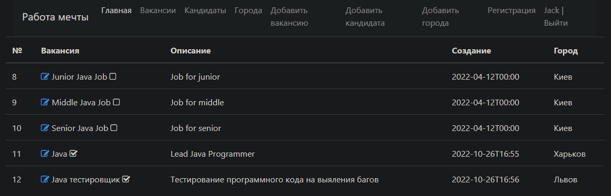

# Проект "Работа мечты"
<p>This project introduces WEB Application on Spring Boot</p>

### Functionality:
* The application works through Internet browser.
* The system has two models: Posts and Candidates
* Candidates will post resumes
* HR will publish job vacancies
* Candidates can apply for a job. HR can invite a candidate for a vacancy.
* User Authorization and Authentication

### Assembly and installation:
1. Create "dreamjob" database
2. Change your PostgreSQL database username and password in 'src/main/resources/app.properties' and
   'db/liquibase.properties'
Using Spring Boot CLI
```shell
mvn spring-boot:run -Dspring-boot.run.arguments=--db=your_database,--user=your_user,--password=your_password,--port=your_port
```
OR using default properties(db=dreamjob, user=postgres, password=password, port=8080)

```shell
mvn spring-boot:run
```

### TODO list
The program can:
1. Create, read, update job posts
2. Create, read, update candidates
3. Create, read, update vacancies cities
4. Add a Candidate photo
5. Register on the website
6. Sing in website

### Used technologies:


### Screenshots




### Contact:
If you have any questions, feel free to contact me https://t.me/VadimDedeyko

<!-- 
brightgreen
green
yellowgreen
yellow
orange
red
blue
lightgrey
success
important
critical
informational
inactive
blueviolet
ff69b4
9cf 
-->
